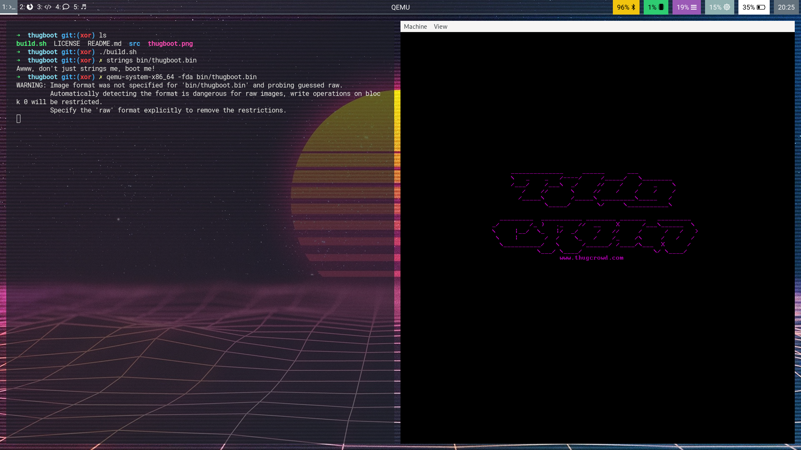

# ThugBoot (Compression Branch)
Generate the [ThugCrowd](https://thugcrowd.com) logo in x86 BIOS assembly.

## About
Not the prettiest x86 asm, but it works. Pieced together the asm from various places online. I plan to use this to learn more about BIOS assembly, but figure it's a decent starting point for someone else too.

## Compression
This branch implements a very basic compression algorithm to try and save space. That goal hasn't really been met yet, but it was interesting to write this algorithm.

The algorithm works by counting repeated characters. For example, "AAA" = `0x41` * 3, gets compressed to `4103` and stoing it as two bytes `\x41\x03`. It's then simple to work backwards and print out the full string without having to store the uncompressed string in memory. This is done by picking 2 bytes at a time, and looping over the second while printing the first. As usual, we terminate the string with a NULL byte and just keep checking to see if the second byte in each pair is `0x0`.

You can find a Python implementation of both the compression and decompression algorithms in [./src/algorithm_dev/compression.py](compression.py). It's not very optimal, but it's main purpose was to generate the compression bytes that could be copied into [./src/thugkernel.asm](thugkernel.asm). For the sake of easier debugging, the decompression routine was written in regular x86 assembly first and can be found in [./src/algorithm_dev/compression.asm](compression.asm).



## Requirements
* Nasm (to build)
* QEMU (to run)

## Building
Run `./build.sh` to generate `bin/thugboot.bin`.

## Running
```
$ qemu-system-x86_64 -fda bin/thugboot.bin
```
